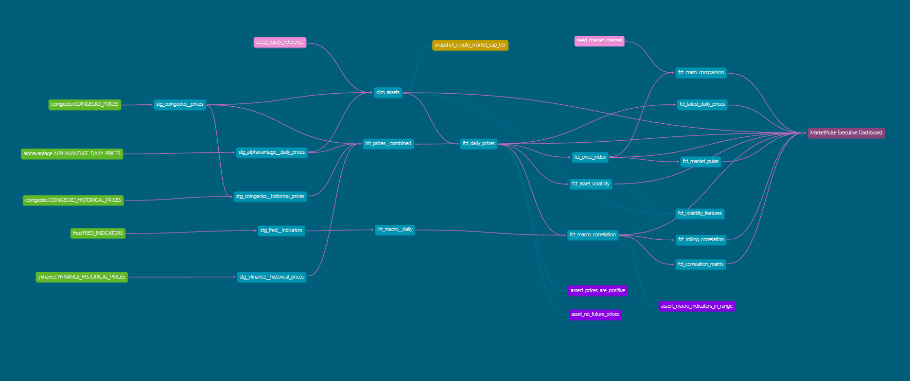

# MarketPulse Analytics

*Daily-refreshed pipeline tracking 60 assets (50 cryptocurrencies and 10 equities) against five macroeconomic indicators*


---

## Why this exists

Crypto, equities, and macro data each get tracked plenty on their own, but rarely sit together on the same grain where you can actually query how they relate. This project pulls all three from independent free-tier APIs into one warehouse, so a question like "does crypto actually move with the Fed Funds rate" has a real, checkable answer instead of a guess.

---

## Key Findings

**1. Crypto and equities move mostly independently of each other**

Full-history correlation between average daily crypto returns and average daily equity returns is **0.14**. Weak positive. The "everything crashes together" assumption doesn't hold up here.

**2. Even within a "top 50" crypto universe, the market cap spread is enormous**

Bitcoin sits at roughly **$1.57 trillion**. The smallest asset in the same tracked list, Ondo, sits at about **$1.72 billion**. Same "top 50 by market cap" universe, a ~900x gap between the biggest and smallest names in it.

**3. Volatility inside crypto varies more than volatility between crypto and equities**

On the same day, 30-day volatility across tracked crypto assets ranges from **0.00%** (BUIDL, a tokenized money market fund) to **7.96%** (PUMP). Lumping "crypto" into one risk bucket hides more than it reveals; the internal spread is bigger than the crypto-vs-equity gap most people assume matters most.

**4. The Fed Funds rate sat completely flat for four straight months (Jan-Apr)**

Flat enough that a 30-day rolling correlation against it becomes mathematically undefined for that whole window, since the formula divides by variance and there was none to divide by. This surfaced as a real division-by-zero bug during development. The fix (clamping the correlation math to a valid range) is documented directly in the model and now guards against the same case anywhere else it could recur.

---

## Architecture

```
CoinGecko API ──┐
Alpha Vantage ───┼──→ Python ingestion ──→ Snowflake RAW ──→ dbt staging (views)
FRED API ────────┘                                                  │
                                                                     ▼
                                                     dbt intermediate (ephemeral)
                                                                     │
                                                                     ▼
                                                  dbt marts (core + finance + ml)
                                                                     │
                                              ┌──────────────────────┴──────────────────────┐
                                              ▼                                              ▼
                                     Looker Studio dashboard                    Streamlit + Gemini (ask-your-data)
```

GitHub Actions orchestrates the nightly run (`.github/workflows/daily_pipeline.yml`). A separate freshness-check workflow runs a few hours later and fails loudly, with an email, if a scheduled run silently didn't fire.

## Stack

| Layer | Tool |
|---|---|
| Ingestion | Python (`requests`, `yfinance`, `snowflake-connector-python`) |
| Warehouse | Snowflake |
| Transformation | dbt (staging → intermediate → marts), `dbt_utils`, `dbt_expectations` |
| Orchestration | GitHub Actions (scheduled pipeline + freshness monitoring) |
| BI | Looker Studio |
| Natural-language query | Streamlit + Google Gemini (text-to-SQL over the warehouse) |
| ML experiment | scikit-learn (Random Forest / Linear Regression, volatility forecasting) |

## Dashboard

*(screenshot placeholder)*

KPI strip, gainers and losers, a rebased cross-asset price index, a 7-day risk-vs-return scatter, rolling and full-history correlation views, a 7-day performance grid, a blended Market Pulse Index, and a current-vs-historical crash drawdown comparison. All of it reads directly from the marts layer described below.

### What each chart shows

- **Price Index (Rebased to 100)**: every asset rescaled to start at 100 on its first tracked day, so a $60k coin and a $200 stock are directly comparable. A line at 150 means that asset is up 50% since tracking began.
- **Market Pulse Index**: every asset's rebased price averaged into one line. Above 100 means the overall tracked market is up since tracking began, below means down. On weekends this reflects crypto only, since equities don't trade.
- **7-Day Performance Grid**: daily % change per asset over the last 7 calendar days. A dash means no trading day (market closed) or data not yet loaded.
- **Risk vs. Return (7-Day)**: each dot is one asset. X-axis is how much it's swung day to day (volatility), Y-axis is how much it's actually moved (return). Bubble size reflects trading volume.
- **30-Day Rolling Correlation vs. Fed Funds Rate**: how closely crypto and equity returns have tracked the Fed Funds rate over the trailing 30 days. +1 means moving together, -1 means moving opposite, 0 means unrelated. Flat stretches at 0 usually mean the Fed Funds rate itself barely moved in that window.
- **Correlation Matrix**: full-history correlation between every pair of tracked series. Closer to 1 or -1 means two things move together (or oppositely) reliably; closer to 0 means no real relationship.
- **Crash Comparison**: SPY's current drawdown from its own tracked-period peak, shown next to widely-cited historical S&P 500 peak-to-trough percentages (2008, the dot-com crash, COVID, etc). Context only, not a prediction that current conditions will reach any of those levels.
- **Daily Avg Change (KPI)**: average % change across all 60 tracked assets today, versus the same average yesterday.
- **7-Day Volatility (KPI)**: how much daily returns have swung over the trailing 7 days. Higher means bigger day-to-day moves.

## dbt lineage



Sources (green) land in `RAW`, staging views clean them 1:1, `int_prices__combined` unions crypto and equity onto one grain, and everything downstream of `fct_daily_prices` fans out into the marts the dashboard reads. Singular tests (purple) and the market-cap-tier snapshot (orange) hang off the models they guard.

## Data model

- **`dim_assets`**: one row per asset (crypto and equity), market-cap tier, sector for equities.
- **`fct_daily_prices`**: the core fact table. One row per asset per day, incremental, a full year of history. Everything else in the marts layer builds on top of this table.
- **`fct_asset_volatility`**: 7/30/90-day rolling volatility and daily volatility ranking per asset.
- **`fct_price_index`**: every asset rebased to 100 on its first tracked day, so a $60k coin and a $200 stock land on the same chart.
- **`fct_market_pulse`**: every asset's indexed price averaged into one blended line per day, plus crypto-only and equity-only sub-lines.
- **`fct_macro_correlation`**: daily prices joined to forward-filled macro indicators.
- **`fct_rolling_correlation`** / **`fct_correlation_matrix`**: 30-day rolling and full-history pairwise correlation across crypto returns, equity returns, and every macro indicator.
- **`fct_crash_comparison`**: SPY's current drawdown from its tracked-period peak, alongside widely-cited historical S&P 500 crash magnitudes, for scale only.
- **`fct_volatility_features`**: feature table behind the ML experiment below.

## Data quality

**61 data tests run on every build, across every layer** (58 schema tests + 3 singular business-rule tests): schema tests (`not_null`, `unique`, `accepted_values`, `relationships`) plus singular tests for business-rule sanity (no negative prices, no future-dated rows, macro indicators within plausible bounds, correlation values bounded to [-1, 1]). `dbt build` runs models and tests together, so bad data gets caught before it reaches a chart.

The freshness-check workflow adds a second layer on top: it runs a few hours after the nightly pipeline and fails if the most recent trading data genuinely isn't there yet, catching a silently-skipped schedule before it shows up as a stale dashboard.

## ML experiment

An attempt at forecasting next-day 7-day volatility. The first version scored well in testing, but only because of a random train/test split on time-series data, which let the model train on rolling windows that nearly duplicated the ones it was being tested against. Switching to a chronological split (train on older dates, test on newer ones the model has never seen) fixed the leak. The honest result afterward: none of the models, Random Forest or Linear Regression, with or without a trend feature, beat a naive "tomorrow looks like today" baseline. Volatility is strongly autocorrelated, so persistence is a genuinely hard baseline to clear, and this counts as a real finding rather than a dead end. The code stays in the repo as an experiment with a documented result, not a feature pretending to work.

## Known limitations

Stated up front rather than buried, since each one shapes how the numbers above should be read.

- **Equity history is backfilled, not native.** Alpha Vantage's free tier caps at roughly 100 days, so the 365-day equity history came from `yfinance`. Daily incremental loads still run through Alpha Vantage, meaning the two halves of the equity series come from different providers.
- **One year of history.** Every correlation, volatility, and index figure is computed over a single year. That is enough to be interesting, not enough to be a regime-spanning claim.
- **Fed Funds correlations are undefined for flat stretches.** The rate sat unchanged Jan-Apr, giving it zero variance, so a rolling correlation against it has no defined value there. Those flat runs at 0 mean "no signal available", not "genuinely uncorrelated".
- **The ML experiment is a negative result.** No model beat a naive persistence baseline. It stays in the repo as a documented finding, not a working feature.
- **Weekend rows are crypto-only.** Equities do not trade, so the blended Market Pulse Index reflects only the crypto half on weekends and holidays.
- **Crash comparison is context, not analysis.** SPY's drawdown is measured from its peak *within the tracked year*, and the historical crash percentages beside it are widely-cited external figures, not values computed from this warehouse.
- **Free-tier upstreams fail sometimes.** CoinGecko, Alpha Vantage, and FRED all rate-limit and occasionally return 5xx. Ingestion retries with backoff; a run that still fails surfaces through the freshness-check workflow rather than silently leaving a gap.

## Project structure

```
ingestion/          Python scripts - daily pulls + one-time historical backfills
marketpulse/
  models/
    staging/        1:1 cleaned views over raw API data, one folder per source
    intermediate/    ephemeral - unions crypto+equity, forward-fills macro gaps
    marts/
      core/          dim_assets, fct_daily_prices, fct_asset_volatility, fct_price_index
      finance/       fct_macro_correlation, fct_rolling_correlation, fct_correlation_matrix
      ml/            fct_volatility_features (feature table for the ML experiment)
  seeds/             static equity sector/company reference data
  snapshots/         SCD Type 2 tracking of crypto market-cap tier changes
  tests/             singular SQL tests (positive prices, no future dates, sane macro ranges)
  ml/                train_volatility_model.py, the forecasting experiment
  app/               streamlit_app.py, natural-language query interface
setup/               one-shot Snowflake account setup/restore script
.github/workflows/   daily pipeline + freshness check
```

## How to run

### Prerequisites

- Python 3.11+
- A Snowflake account
- API keys: Alpha Vantage, FRED, Google (Gemini), all free tier

### Setup

```bash
git clone https://github.com/halo3buff/marketpulse-analytics
cd marketpulse-analytics

python -m venv venv
venv\Scripts\activate      # Windows
source venv/bin/activate   # Mac/Linux

pip install -r requirements.txt
```

Run `setup/snowflake_setup.sql` in a Snowflake worksheet once. It creates the warehouse, database, schemas, and a dedicated `dbt` role/user.

Create a `.env` in the project root:

```bash
SNOWFLAKE_ACCOUNT=xxxxxxx-xxxxxxx
SNOWFLAKE_USER=dbt_user
SNOWFLAKE_PASSWORD=...
SNOWFLAKE_DATABASE=MARKETPULSE
SNOWFLAKE_WAREHOUSE=MARKETPULSE_WH

ALPHAVANTAGE_API_KEY=...    # daily equity prices
FRED_API_KEY=...            # macro indicators
GOOGLE_API_KEY=...          # Gemini, only needed for the Streamlit app
```

dbt reads `SNOWFLAKE_ACCOUNT`, `SNOWFLAKE_USER`, and `SNOWFLAKE_PASSWORD` from the same file via `profiles.yml`; role, database, and warehouse are pinned there. The same names are the secrets the GitHub Actions workflows expect.

### Run the pipeline

```bash
python -m ingestion.run_all                        # daily live snapshot: crypto, equity, macro
python -m ingestion.backfill_coingecko_history      # 365 days of crypto history
python -m ingestion.backfill_yfinance_history       # 365 days of equity history

cd marketpulse
dbt deps
dbt build
```

### Run the natural-language query app

```bash
cd marketpulse/app
streamlit run streamlit_app.py
```

## Data sources

- [CoinGecko API](https://www.coingecko.com/en/api): crypto market data, top 50 by market cap
- [Alpha Vantage](https://www.alphavantage.co/): daily equity prices
- [yfinance](https://github.com/ranaroussi/yfinance): historical equity backfill (Alpha Vantage's free tier caps at roughly 100 days)
- [FRED](https://fred.stlouisfed.org/): Fed Funds Rate, CPI, unemployment, 10-year Treasury yield, USD/EUR rate

## License

MIT - see [LICENSE](LICENSE).
